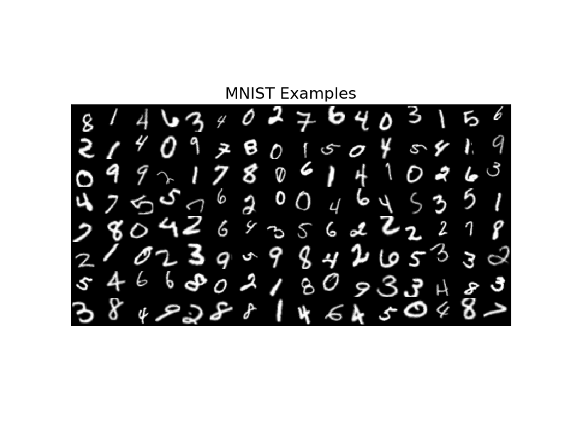
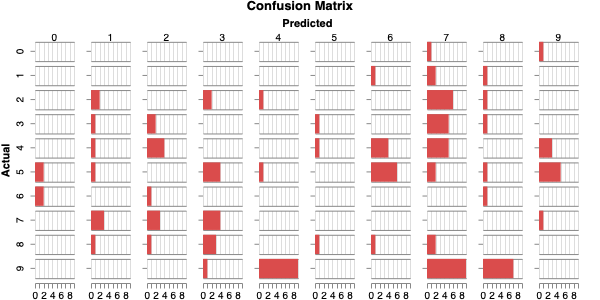

# DigitNet

**DigitNet** is a simple convolutional neural network designed to classify handwritten digits from the MNIST dataset. It is implemented in Python using the following libraries:

- **PyTorch** for GPU acceleration (specifically, using the MPS backend).
- **PyTorch Lightning** as a high-level wrapper for PyTorch to simplify training.

## Dataset

The model is trained on the **MNIST** dataset, which consists of 60,000 training images and 10,000 test images of handwritten digits. The model achieves:

- **Top-1 accuracy**: 98.5% on the test set.
- **Top-2 accuracy**: 99.8% on a highly augmented test set.

> **Top-k accuracy** refers to the model's ability to include the correct label in its top `k` predictions. For example, a top-2 accuracy of 99.8% means that the correct label is one of the top two predictions 99.8% of the time.

## Model Architecture

The architecture of DigitNet is inspired by:

- [ConvNeXt](https://arxiv.org/pdf/2201.03545)
- [ConvNet-v2](https://arxiv.org/pdf/2301.00808) (specifically, the Global Response Normalization (GRN) block)

The model, however, is **not** trained with the Fully Convolutional Masked Autoencoder (FCMAE).

### Key Model Features:

- **Residual Depthwise Separable Convolutions**
- **1-1-3-1 bottleneck structure**
- ~500k parameters (intentionally overparameterized)
- Trained using **AdamW** optimizer

The model is trained with a batch size of 128 for 10 epochs.

## Training

The model is optimized using a **cross-entropy loss** without label smoothing. This choice was made because [label smoothing can negatively impact teacher distillation](https://arxiv.org/pdf/1906.02629).

### Results

The confusion matrix above shows the model's performance on the test set. The model performs well on most digits, with the most confusion between 4s, 7s, and 9s. It also seems to over predict 7s.

## License

This project is licensed under the **MIT License**. See the [LICENSE](LICENSE) file for more details.
