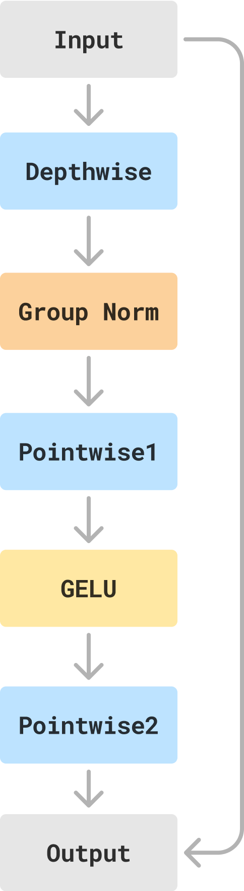

# digitnet

The digitnet family of models are a series of models trained on the QMNIST datasets. The models are trained to classify images of handwritten digits into one of ten classes, corresponding to the digits 0-9. The models are trained using the PyTorch framework.

## Model Details

### Model Description

- **Developed by:** Karan Ravindra
- **Model type:** Convolutional Neural Network
- **License:** MIT

### Model Sources

- **Repository:** [Github](https://github.com/karanravindra/digitnet)
  <!-- - **Paper [optional]:** [More Information Needed] -->
  <!-- - **Demo [optional]:** [More Information Needed] -->

## Uses

### Direct Use

These models can be used to classify images of handwritten digits into one of ten classes, corresponding to the digits 0-9.

### Downstream Use

These models can be used as a component in a larger machine learning system, such as a system for recognizing handwritten digits in a larger document, or to train a custom LPIPS model.

## How to Get Started with the Model

Use the code below to get started with the model.

```python
TODO: Add implementation code
```

## Training Details

All training and implementation details can be found in the [Github repository](https://github.com/karanravindra/digitnet).

### Results

TODO: Add confusion matrix and other results

#### sm

Layer (type:depth-idx) Output Shape Param #
ModelForImageClassification [1, 10]--
├─GroupNorm: 1-1 [1, 1, 32, 32] 2
├─Depthwise: 1-2 [1, 2, 32, 32] 42
├─MaxPool2d: 1-3 [1, 2, 16, 16] --
├─Depthwise: 1-4 [1, 4, 16, 16] 100
├─MaxPool2d: 1-5 [1, 4, 8, 8] --
├─Depthwise: 1-6 [1, 8, 8, 8] 264
├─Depthwise: 1-7 [1, 8, 8, 8] 368
├─Depthwise: 1-8 [1, 8, 8, 8] 368
├─MaxPool2d: 1-9 [1, 8, 4, 4] --
├─Depthwise: 1-10 [1, 8, 4, 4] 368
├─Linear: 1-11 [1, 10] 1,290

Total params: 2,802
Trainable params: 2,802
Non-trainable params: 0
Total mult-adds (Units.MEGABYTES): 0.13

Input size (MB): 0.00
Forward/backward pass size (MB): 0.16
Params size (MB): 0.01
Estimated Total Size (MB): 0.18

Epoch 1: [loss=1.38, acc=0.729, val_loss=inf, val_acc=0]

Epoch 2: [loss=1.24, acc=0.844, val_loss=1.39, val_acc=0.76]

Epoch 3: [loss=1.14, acc=0.927, val_loss=1.25, val_acc=0.84]

Epoch 4: [loss=1.2, acc=0.854, val_loss=1.18, val_acc=0.884]

Epoch 5: [loss=1.23, acc=0.823, val_loss=1.14, val_acc=0.896]

Epoch 6: [loss=1.08, acc=0.958, val_loss=1.12, val_acc=0.905]

Epoch 7: [loss=1.13, acc=0.885, val_loss=1.11, val_acc=0.91]

Epoch 8: [loss=1.05, acc=0.948, val_loss=1.09, val_acc=0.917]

Epoch 9: [loss=1.05, acc=0.927, val_loss=1.09, val_acc=0.92]

Epoch 10: [loss=1.07, acc=0.938, val_loss=1.09, val_acc=0.921]

Epoch 11: [loss=1.05, acc=0.958, val_loss=1.08, val_acc=0.924]

Epoch 12: [loss=1.09, acc=0.938, val_loss=1.07, val_acc=0.932]

Epoch 13: [loss=1.07, acc=0.927, val_loss=1.07, val_acc=0.931]

Epoch 14: [loss=1.04, acc=0.948, val_loss=1.07, val_acc=0.929]

Epoch 15: [loss=1.14, acc=0.885, val_loss=1.06, val_acc=0.935]

Epoch 16: [loss=1.04, acc=0.948, val_loss=1.06, val_acc=0.934]

Epoch 17: [loss=1.08, acc=0.896, val_loss=1.06, val_acc=0.933]

Epoch 18: [loss=1.04, acc=0.938, val_loss=1.05, val_acc=0.937]

Epoch 19: [loss=1.11, acc=0.896, val_loss=1.05, val_acc=0.934]

Epoch 20: [loss=1.04, acc=0.917, val_loss=1.05, val_acc=0.939]

Epoch 21: [loss=1.05, acc=0.938, val_loss=1.04, val_acc=0.939]

Epoch 22: [loss=1.07, acc=0.927, val_loss=1.04, val_acc=0.942]

Epoch 23: [loss=1.09, acc=0.896, val_loss=1.04, val_acc=0.945]

Epoch 24: [loss=1.09, acc=0.896, val_loss=1.04, val_acc=0.942]

Epoch 25: [loss=1.04, acc=0.927, val_loss=1.03, val_acc=0.946]

Epoch 26: [loss=1.05, acc=0.948, val_loss=1.04, val_acc=0.942]

Epoch 27: [loss=1.04, acc=0.948, val_loss=1.03, val_acc=0.94]

Epoch 28: [loss=1.03, acc=0.948, val_loss=1.03, val_acc=0.946]

Epoch 29: [loss=1.03, acc=0.917, val_loss=1.03, val_acc=0.947]

Epoch 30: [loss=1.07, acc=0.917, val_loss=1.03, val_acc=0.945]

Epoch 31: [loss=1.09, acc=0.917, val_loss=1.03, val_acc=0.946]

Epoch 32: [loss=1.03, acc=0.938, val_loss=1.02, val_acc=0.947]

Epoch 33: [loss=0.999, acc=0.979, val_loss=1.03, val_acc=0.948]

Epoch 34: [loss=1.01, acc=0.958, val_loss=1.02, val_acc=0.945]

Epoch 35: [loss=1, acc=0.958, val_loss=1.02, val_acc=0.949]

Epoch 36: [loss=0.999, acc=0.958, val_loss=1.03, val_acc=0.946]

Epoch 37: [loss=1.01, acc=0.958, val_loss=1.02, val_acc=0.948]

Epoch 38: [loss=1.05, acc=0.927, val_loss=1.02, val_acc=0.952]

Epoch 39: [loss=1.03, acc=0.938, val_loss=1.02, val_acc=0.954]

Epoch 40: [loss=1.01, acc=0.958, val_loss=1.02, val_acc=0.946]

Epoch 41: [loss=1.03, acc=0.948, val_loss=1.02, val_acc=0.95]

Epoch 42: [loss=0.994, acc=0.969, val_loss=1.02, val_acc=0.947]

Epoch 43: [loss=1.08, acc=0.927, val_loss=1.01, val_acc=0.952]

Epoch 44: [loss=1.09, acc=0.927, val_loss=1.01, val_acc=0.951]

Epoch 45: [loss=0.988, acc=0.99, val_loss=1.01, val_acc=0.952]

Epoch 46: [loss=1, acc=0.938, val_loss=1.02, val_acc=0.948]

Epoch 47: [loss=1.07, acc=0.927, val_loss=1.01, val_acc=0.952]

Epoch 48: [loss=1.01, acc=0.948, val_loss=1, val_acc=0.955]

Epoch 49: [loss=0.955, acc=0.99, val_loss=1.01, val_acc=0.955]

Epoch 50: [loss=0.994, acc=0.958, val_loss=1.01, val_acc=0.956]

Test loss: 1.0146, Test accuracy: 0.9478

#### md

Layer (type:depth-idx) | Output Shape | Param #

ModelForImageClassification [1, 10] --
├─GroupNorm: 1-1 [1, 1, 32, 32] 2
├─Depthwise: 1-2 [1, 4, 32, 32] 64
├─MaxPool2d: 1-3 [1, 4, 16, 16] --
├─Depthwise: 1-4 [1, 8, 16, 16] 264
├─MaxPool2d: 1-5 [1, 8, 8, 8] --
├─Depthwise: 1-6 [1, 16, 8, 8] 784
├─Depthwise: 1-7 [1, 16, 8, 8] 992
├─Depthwise: 1-8 [1, 16, 8, 8] 992
├─MaxPool2d: 1-9 [1, 16, 4, 4] --
├─Depthwise: 1-10 [1, 16, 4, 4] 992
├─Linear: 1-11 [1, 10] 2,570

Total params: 6,660
Trainable params: 6,660
Non-trainable params: 0
Total mult-adds (Units.MEGABYTES): 0.32

Input size (MB): 0.00
Forward/backward pass size (MB): 0.29
Params size (MB): 0.03
Estimated Total Size (MB): 0.33

Epoch 1: [loss=1.34, acc=0.781, val_loss=inf, val_acc=0]

Epoch 2: [loss=1.15, acc=0.896, val_loss=1.3, val_acc=0.818]

Epoch 3: [loss=1.12, acc=0.927, val_loss=1.17, val_acc=0.887]

Epoch 4: [loss=1.04, acc=0.958, val_loss=1.12, val_acc=0.91]

Epoch 5: [loss=1.03, acc=0.969, val_loss=1.09, val_acc=0.924]

Epoch 6: [loss=1.02, acc=0.958, val_loss=1.06, val_acc=0.936]

Epoch 7: [loss=1.03, acc=0.938, val_loss=1.05, val_acc=0.941]

Epoch 8: [loss=1.04, acc=0.938, val_loss=1.04, val_acc=0.939]

Epoch 9: [loss=0.975, acc=0.958, val_loss=1.03, val_acc=0.946]

Epoch 10: [loss=1.01, acc=0.958, val_loss=1.02, val_acc=0.949]

Epoch 11: [loss=1.03, acc=0.948, val_loss=1.01, val_acc=0.953]

Epoch 12: [loss=1, acc=0.948, val_loss=1, val_acc=0.956]

Epoch 13: [loss=0.994, acc=0.948, val_loss=1, val_acc=0.958]

Epoch 14: [loss=0.996, acc=0.979, val_loss=0.996, val_acc=0.96]

Epoch 15: [loss=0.954, acc=1, val_loss=0.995, val_acc=0.961]

Epoch 16: [loss=1.01, acc=0.958, val_loss=0.992, val_acc=0.96]

Epoch 17: [loss=0.984, acc=0.979, val_loss=0.987, val_acc=0.962]

Epoch 18: [loss=1.02, acc=0.938, val_loss=0.986, val_acc=0.962]

Epoch 19: [loss=1.01, acc=0.938, val_loss=0.983, val_acc=0.963]

Epoch 20: [loss=0.941, acc=1, val_loss=0.979, val_acc=0.966]

Epoch 21: [loss=0.955, acc=0.979, val_loss=0.978, val_acc=0.964]

Epoch 22: [loss=0.964, acc=0.969, val_loss=0.975, val_acc=0.967]

Epoch 23: [loss=1.06, acc=0.927, val_loss=0.971, val_acc=0.967]

Epoch 24: [loss=0.95, acc=0.979, val_loss=0.976, val_acc=0.963]

Epoch 25: [loss=1.03, acc=0.927, val_loss=0.971, val_acc=0.966]

Epoch 26: [loss=0.977, acc=0.969, val_loss=0.968, val_acc=0.969]

Epoch 27: [loss=0.981, acc=0.969, val_loss=0.971, val_acc=0.967]

Epoch 28: [loss=0.979, acc=0.958, val_loss=0.967, val_acc=0.968]

Epoch 29: [loss=0.998, acc=0.948, val_loss=0.963, val_acc=0.97]

Epoch 30: [loss=0.991, acc=0.948, val_loss=0.967, val_acc=0.967]

Epoch 31: [loss=0.95, acc=0.979, val_loss=0.964, val_acc=0.968]

Epoch 32: [loss=0.977, acc=0.969, val_loss=0.96, val_acc=0.971]

Epoch 33: [loss=0.974, acc=0.969, val_loss=0.957, val_acc=0.971]

Epoch 34: [loss=0.963, acc=0.969, val_loss=0.959, val_acc=0.97]

Epoch 35: [loss=1.01, acc=0.938, val_loss=0.961, val_acc=0.97]

Epoch 36: [loss=0.999, acc=0.927, val_loss=0.961, val_acc=0.971]

Epoch 37: [loss=0.954, acc=0.979, val_loss=0.953, val_acc=0.974]

Epoch 38: [loss=0.966, acc=0.969, val_loss=0.955, val_acc=0.973]

Epoch 39: [loss=0.967, acc=0.958, val_loss=0.959, val_acc=0.97]

Epoch 40: [loss=0.954, acc=0.958, val_loss=0.955, val_acc=0.971]

Epoch 41: [loss=0.938, acc=0.979, val_loss=0.954, val_acc=0.972]

Epoch 42: [loss=0.963, acc=0.979, val_loss=0.953, val_acc=0.971]

Epoch 43: [loss=0.957, acc=0.979, val_loss=0.953, val_acc=0.971]

Epoch 44: [loss=0.941, acc=0.979, val_loss=0.95, val_acc=0.973]

Epoch 45: [loss=0.946, acc=0.979, val_loss=0.949, val_acc=0.974]

Epoch 46: [loss=0.957, acc=0.969, val_loss=0.947, val_acc=0.975]

Epoch 47: [loss=0.92, acc=0.99, val_loss=0.944, val_acc=0.977]

Epoch 48: [loss=0.961, acc=0.969, val_loss=0.953, val_acc=0.973]

Epoch 49: [loss=0.936, acc=0.99, val_loss=0.943, val_acc=0.978]

Epoch 50: [loss=0.955, acc=0.969, val_loss=0.943, val_acc=0.977]

Test loss: 0.9517, Test accuracy: 0.9711

#### lg

Layer (type:depth-idx) | Output Shape | Param #

ModelForImageClassification [1, 10] --
├─GroupNorm: 1-1 [1, 1, 32, 32] 2
├─Depthwise: 1-2 [1, 6, 32, 32] 94
├─MaxPool2d: 1-3 [1, 6, 16, 16] --
├─Depthwise: 1-4 [1, 12, 16, 16] 492
├─MaxPool2d: 1-5 [1, 12, 8, 8] --
├─Depthwise: 1-6 [1, 24, 8, 8] 1,560
├─Depthwise: 1-7 [1, 24, 8, 8] 1,872
├─Depthwise: 1-8 [1, 24, 8, 8] 1,872
├─MaxPool2d: 1-9 [1, 24, 4, 4] --
├─Depthwise: 1-10 [1, 24, 4, 4] 1,872
├─Linear: 1-11 [1, 10] 3,850

Total params: 11,614
Trainable params: 11,614
Non-trainable params: 0
Total mult-adds (Units.MEGABYTES): 0.58

Input size (MB): 0.00
Forward/backward pass size (MB): 0.43
Params size (MB): 0.05
Estimated Total Size (MB): 0.48

Epoch 1: [loss=1.19, acc=0.865, val_loss=inf, val_acc=0]

Epoch 2: [loss=1.08, acc=0.938, val_loss=1.17, val_acc=0.894]

Epoch 3: [loss=1.06, acc=0.938, val_loss=1.08, val_acc=0.93]

Epoch 4: [loss=0.966, acc=0.979, val_loss=1.03, val_acc=0.948]

Epoch 5: [loss=1.03, acc=0.917, val_loss=1.01, val_acc=0.956]

Epoch 6: [loss=0.972, acc=0.958, val_loss=0.996, val_acc=0.965]

Epoch 7: [loss=0.981, acc=0.958, val_loss=0.986, val_acc=0.964]

Epoch 8: [loss=0.984, acc=0.969, val_loss=0.978, val_acc=0.969]

Epoch 9: [loss=0.979, acc=0.969, val_loss=0.976, val_acc=0.969]

Epoch 10: [loss=0.977, acc=0.969, val_loss=0.968, val_acc=0.971]

Epoch 11: [loss=0.961, acc=0.958, val_loss=0.962, val_acc=0.974]

Epoch 12: [loss=0.95, acc=0.969, val_loss=0.954, val_acc=0.976]

Epoch 13: [loss=0.96, acc=0.99, val_loss=0.953, val_acc=0.977]

Epoch 14: [loss=0.977, acc=0.948, val_loss=0.951, val_acc=0.977]

Epoch 15: [loss=0.932, acc=0.979, val_loss=0.946, val_acc=0.978]

Epoch 16: [loss=0.994, acc=0.969, val_loss=0.953, val_acc=0.975]

Epoch 17: [loss=0.935, acc=1, val_loss=0.942, val_acc=0.978]

Epoch 18: [loss=0.996, acc=0.948, val_loss=0.945, val_acc=0.98]

Epoch 19: [loss=0.937, acc=0.99, val_loss=0.942, val_acc=0.978]

Epoch 20: [loss=0.964, acc=0.969, val_loss=0.937, val_acc=0.981]

Epoch 21: [loss=0.923, acc=1, val_loss=0.936, val_acc=0.981]

Epoch 22: [loss=0.943, acc=0.979, val_loss=0.934, val_acc=0.98]

Epoch 23: [loss=0.93, acc=0.979, val_loss=0.931, val_acc=0.983]

Epoch 24: [loss=0.942, acc=0.979, val_loss=0.932, val_acc=0.98]

Epoch 25: [loss=0.968, acc=0.958, val_loss=0.928, val_acc=0.984]

Epoch 26: [loss=0.914, acc=0.99, val_loss=0.931, val_acc=0.984]

Epoch 27: [loss=0.923, acc=0.979, val_loss=0.927, val_acc=0.983]

Epoch 28: [loss=0.919, acc=0.99, val_loss=0.924, val_acc=0.982]

Epoch 29: [loss=0.93, acc=0.979, val_loss=0.924, val_acc=0.983]

Epoch 30: [loss=0.907, acc=0.99, val_loss=0.925, val_acc=0.983]

Epoch 31: [loss=0.94, acc=0.958, val_loss=0.926, val_acc=0.984]

Epoch 32: [loss=0.898, acc=1, val_loss=0.922, val_acc=0.983]

Epoch 33: [loss=0.953, acc=0.969, val_loss=0.927, val_acc=0.982]

Epoch 34: [loss=0.958, acc=0.969, val_loss=0.925, val_acc=0.981]

Epoch 35: [loss=0.906, acc=0.979, val_loss=0.918, val_acc=0.985]

Epoch 36: [loss=0.904, acc=0.99, val_loss=0.923, val_acc=0.983]

Epoch 37: [loss=0.926, acc=0.979, val_loss=0.918, val_acc=0.984]

Epoch 38: [loss=0.922, acc=0.99, val_loss=0.924, val_acc=0.981]

Epoch 39: [loss=0.899, acc=0.99, val_loss=0.916, val_acc=0.986]

Epoch 40: [loss=0.927, acc=0.979, val_loss=0.915, val_acc=0.985]

Epoch 41: [loss=0.905, acc=1, val_loss=0.917, val_acc=0.984]

Epoch 42: [loss=0.928, acc=0.979, val_loss=0.916, val_acc=0.985]

Epoch 43: [loss=0.905, acc=1, val_loss=0.913, val_acc=0.986]

Epoch 44: [loss=0.898, acc=1, val_loss=0.919, val_acc=0.983]

Epoch 45: [loss=0.963, acc=0.969, val_loss=0.915, val_acc=0.985]

Epoch 46: [loss=0.935, acc=0.958, val_loss=0.915, val_acc=0.985]

Epoch 47: [loss=0.914, acc=0.969, val_loss=0.91, val_acc=0.987]

Epoch 48: [loss=0.921, acc=0.99, val_loss=0.912, val_acc=0.987]

Epoch 49: [loss=0.92, acc=0.979, val_loss=0.91, val_acc=0.987]

Epoch 50: [loss=0.899, acc=0.99, val_loss=0.911, val_acc=0.986]

Test loss: 0.9201, Test accuracy: 0.9817

#### xl

Layer (type:depth-idx) | Output Shape | Param #

ModelForImageClassification [1, 10] --
├─GroupNorm: 1-1 [1, 1, 32, 32] 2
├─Depthwise: 1-2 [1, 8, 32, 32] 132
├─MaxPool2d: 1-3 [1, 8, 16, 16] --
├─Depthwise: 1-4 [1, 16, 16, 16] 784
├─MaxPool2d: 1-5 [1, 16, 8, 8] --
├─Depthwise: 1-6 [1, 32, 8, 8] 2,592
├─Depthwise: 1-7 [1, 32, 8, 8] 3,008
├─Depthwise: 1-8 [1, 32, 8, 8] 3,008
├─MaxPool2d: 1-9 [1, 32, 4, 4] --
├─Depthwise: 1-10 [1, 32, 4, 4] 3,008
├─Linear: 1-11 [1, 10] 5,130

Total params: 17,664
Trainable params: 17,664
Non-trainable params: 0
Total mult-adds (Units.MEGABYTES): 0.92

Input size (MB): 0.00
Forward/backward pass size (MB): 0.57
Params size (MB): 0.07
Estimated Total Size (MB): 0.64

Epoch 1: [loss=1.25, acc=0.844, val_loss=inf, val_acc=0]

Epoch 2: [loss=1.05, acc=0.948, val_loss=1.16, val_acc=0.895]

Epoch 3: [loss=1.05, acc=0.948, val_loss=1.06, val_acc=0.939]

Epoch 4: [loss=1.04, acc=0.948, val_loss=1.03, val_acc=0.951]

Epoch 5: [loss=1.02, acc=0.958, val_loss=1, val_acc=0.963]

Epoch 6: [loss=1.01, acc=0.969, val_loss=1, val_acc=0.958]

Epoch 7: [loss=0.966, acc=0.969, val_loss=0.984, val_acc=0.967]

Epoch 8: [loss=0.968, acc=0.979, val_loss=0.971, val_acc=0.972]

Epoch 9: [loss=0.95, acc=0.979, val_loss=0.969, val_acc=0.971]

Epoch 10: [loss=0.943, acc=0.979, val_loss=0.962, val_acc=0.974]

Epoch 11: [loss=0.952, acc=0.979, val_loss=0.956, val_acc=0.974]

Epoch 12: [loss=0.936, acc=0.99, val_loss=0.951, val_acc=0.976]

Epoch 13: [loss=0.962, acc=0.958, val_loss=0.955, val_acc=0.975]

Epoch 14: [loss=0.933, acc=0.99, val_loss=0.943, val_acc=0.98]

Epoch 15: [loss=0.938, acc=0.99, val_loss=0.945, val_acc=0.978]

Epoch 16: [loss=0.957, acc=0.958, val_loss=0.939, val_acc=0.981]

Epoch 17: [loss=0.942, acc=0.979, val_loss=0.938, val_acc=0.98]

Epoch 18: [loss=0.935, acc=0.969, val_loss=0.934, val_acc=0.982]

Epoch 19: [loss=0.961, acc=0.969, val_loss=0.93, val_acc=0.983]

Epoch 20: [loss=0.958, acc=0.969, val_loss=0.932, val_acc=0.981]

Epoch 21: [loss=0.953, acc=0.969, val_loss=0.927, val_acc=0.983]

Epoch 22: [loss=0.965, acc=0.969, val_loss=0.929, val_acc=0.982]

Epoch 23: [loss=0.939, acc=0.979, val_loss=0.927, val_acc=0.983]

Epoch 24: [loss=0.913, acc=1, val_loss=0.923, val_acc=0.985]

Epoch 25: [loss=0.942, acc=0.969, val_loss=0.922, val_acc=0.983]

Epoch 26: [loss=0.915, acc=0.979, val_loss=0.921, val_acc=0.984]

Epoch 27: [loss=0.928, acc=0.979, val_loss=0.924, val_acc=0.981]

Epoch 28: [loss=0.903, acc=0.99, val_loss=0.92, val_acc=0.983]

Epoch 29: [loss=0.931, acc=0.969, val_loss=0.918, val_acc=0.982]

Epoch 30: [loss=0.914, acc=0.99, val_loss=0.918, val_acc=0.982]

Epoch 31: [loss=0.934, acc=0.969, val_loss=0.921, val_acc=0.982]

Epoch 32: [loss=0.9, acc=1, val_loss=0.915, val_acc=0.984]

Epoch 33: [loss=0.902, acc=1, val_loss=0.915, val_acc=0.985]

Epoch 34: [loss=0.906, acc=0.99, val_loss=0.91, val_acc=0.988]

Epoch 35: [loss=0.909, acc=0.99, val_loss=0.914, val_acc=0.986]

Epoch 36: [loss=0.901, acc=1, val_loss=0.918, val_acc=0.983]

Epoch 37: [loss=0.934, acc=0.979, val_loss=0.913, val_acc=0.985]

Epoch 38: [loss=0.9, acc=0.99, val_loss=0.915, val_acc=0.984]

Epoch 39: [loss=0.912, acc=0.99, val_loss=0.91, val_acc=0.986]

Epoch 40: [loss=0.908, acc=0.99, val_loss=0.909, val_acc=0.986]

Epoch 41: [loss=0.907, acc=0.99, val_loss=0.909, val_acc=0.986]

Epoch 42: [loss=0.916, acc=0.99, val_loss=0.906, val_acc=0.987]

Epoch 43: [loss=0.902, acc=0.99, val_loss=0.91, val_acc=0.985]

Epoch 44: [loss=0.938, acc=0.969, val_loss=0.912, val_acc=0.984]

Epoch 45: [loss=0.899, acc=1, val_loss=0.908, val_acc=0.986]

Epoch 46: [loss=0.953, acc=0.958, val_loss=0.907, val_acc=0.987]

Epoch 47: [loss=0.917, acc=0.979, val_loss=0.906, val_acc=0.985]

Epoch 48: [loss=0.939, acc=0.958, val_loss=0.903, val_acc=0.988]

Epoch 49: [loss=0.912, acc=0.979, val_loss=0.91, val_acc=0.985]

Epoch 50: [loss=0.884, acc=1, val_loss=0.906, val_acc=0.986]

Test loss: 0.9059, Test accuracy: 0.9855

## Environmental Impact

- **Hardware Type:** Apple M3 Pro
- **Hours used:** 20 minutes
- **Cloud Provider:** Private Server
- **Carbon Emitted:** Very Low

## Technical Specifications

### Model Architecture and Objective



## Citation

<!-- If there is a paper or blog post introducing the model, the APA and Bibtex information for that should go in this section. -->
